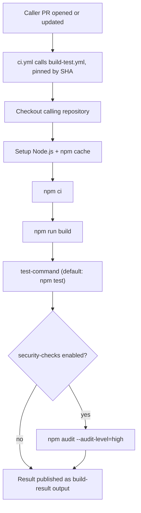
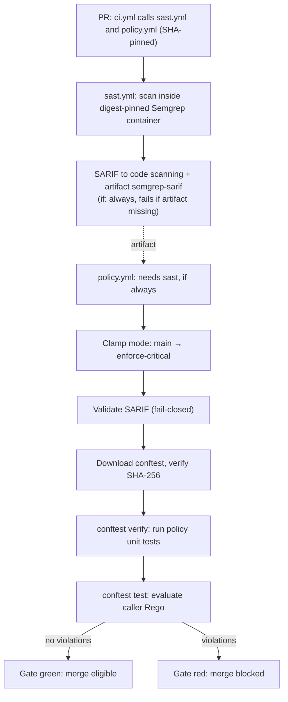

# Reusable Build & Test

A set of reusable GitHub Actions workflows that gives any repository in this org the same
Node.js build, test, and security pipeline (install/build/test/audit, a static analysis
scan, and a fail-closed policy gate) without redefining it in every repo.

## Why this repository exists

CI configuration tends to get copied between repositories, then drifts: different Node
versions, unpinned actions, forgotten audit steps. The goal here is one maintained pipeline.
A caller repository keeps a few jobs in its own workflow file and delegates everything
else to this repository. Runner images, Node defaults, action updates, scanner tooling,
and gate policy mechanics are decided once here and rolled out to callers by moving a
release tag's commit SHA.

## Workflows at a glance

| Workflow | File | What it provides |
|---|---|---|
| Build & Test | `build-test.yml` | `npm ci`, build, test, `npm audit` |
| SAST | `sast.yml` | digest-pinned Semgrep scan; SARIF to code scanning + artifact |
| Policy Gate | `policy.yml` | fail-closed OPA/conftest gate over the scan results |

The security pair (`sast.yml` + `policy.yml`) is designed to be called together: the scan
produces a SARIF artifact, the gate consumes it and decides merge eligibility. What the
gate decides (modes, exemptions, deny rules) is Rego policy owned by the caller; the
workflow provides the trusted mechanics around it.

## What build-test.yml does

Triggered through `workflow_call`. Runs on `ubuntu-24.04` with `contents: read`
permissions and no access to caller secrets:

1. Check out the calling repository
2. Set up Node.js (`node-version` input, npm cache keyed on the caller's lockfile)
3. `npm ci`
4. `npm run build`
5. Run `test-command`
6. If `security-checks` is true, `npm audit --audit-level=high`



## How the security gate works



**Scan (`sast.yml`)**

- Semgrep runs from a digest-pinned container (`semgrep/semgrep:1.179.0@sha256:…`);
  nothing is installed at runtime and no rule source is fetched from the network;
  the caller passes a vendored rule bundle (`semgrep-config`, default
  `policy/semgrep-rules`).
- `--no-rewrite-rule-ids` keeps registry rule IDs intact so code-scanning alerts
  deduplicate across runs.
- The SARIF file is uploaded to code scanning and archived as an artifact
  (`semgrep-sarif`, 1-day retention, `if-no-files-found: error`) for the gate.

**Gate (`policy.yml`)**

Every step fails closed (anomaly ⇒ red, never green):

1. **Mode clamp**: when the ref is `main` (base or head), the effective mode is forced
   to `enforce-critical` regardless of the caller's `mode` input; callers cannot relax
   the gate for merges. An unknown mode is a hard error.
2. **SARIF validation**: non-empty file, valid JSON, `runs[]`, Semgrep tool name,
   `results`, and `tool.driver.rules` (needed to resolve severity).
3. **Trusted toolchain**: conftest is installed to `$RUNNER_TEMP` and checked against
   the embedded `conftest-sha256` before execution.
4. **Policy unit tests first**: `conftest verify` must pass before the gate evaluates.
5. **Evaluation**: `conftest test --parser json --output github` against
   `{mode, sarif}` input; findings annotate the run (warning or error by mode).

### Gate modes

| Mode | Behavior |
|---|---|
| `warn` | advisory only: findings annotate the run, never block |
| `enforce-critical` | blocks on findings at error level |
| `enforce-full` | blocks on every finding, any level |

The gate job must be wired with `if: ${{ always() }}` and `needs: [sast]` (as in the
usage example): if the scan fails or its artifact is missing, the gate still runs
and fails rather than silently passing.

## Usage

```yaml
jobs:
  build-and-test:
    name: Build & Test
    uses: enofei/reusable-build-test/.github/workflows/build-test.yml@de6baabebe8d9663ba701d49ea026d5a07cf1575  # v1.0.0
    with:
      node-version: '24'
      test-command: 'npm run test:ci'
      security-checks: true

  sast:
    name: SAST
    permissions:
      contents: read
      security-events: write
    uses: enofei/reusable-build-test/.github/workflows/sast.yml@de6baabebe8d9663ba701d49ea026d5a07cf1575  # v1.0.0
    with:
      semgrep-config: 'policy/semgrep-rules'

  policy:
    name: Policy
    if: ${{ always() }}
    needs: [sast]
    permissions:
      contents: read
      actions: read
    uses: enofei/reusable-build-test/.github/workflows/policy.yml@de6baabebe8d9663ba701d49ea026d5a07cf1575  # v1.0.0
    with:
      mode: 'enforce-critical'
      policy-path: 'policy/'
```

Always pin a full commit SHA with a version comment. Branch and tag refs are mutable and
can change after review; a SHA cannot.

Check names appear as `<caller job name> / <inner job name>`; with the names above:
`Build & Test / Build & Test`, `SAST / Semgrep`, `Policy / Gate`. Those exact strings
are what a caller lists in branch protection as required status checks.

## Inputs

### build-test.yml

| Input | Type | Default | Description |
|---|---|---|---|
| `node-version` | string | `'24'` | Node.js version passed to `actions/setup-node` (current LTS line) |
| `test-command` | string | `'npm test'` | Command run after the build |
| `working-directory` | string | `'.'` | Directory containing the Node project |
| `security-checks` | boolean | `false` | Also run `npm audit --audit-level=high` |

### sast.yml

| Input | Type | Default | Description |
|---|---|---|---|
| `semgrep-config` | string | `'policy/semgrep-rules'` | Vendored rule bundle path (default) or registry ref |
| `paths` | string | `'.'` | Paths to scan (space-separated) |

### policy.yml

| Input | Type | Default | Description |
|---|---|---|---|
| `mode` | string | `'enforce-critical'` | `warn` \| `enforce-critical` \| `enforce-full`; `main` is clamped to `enforce-critical` |
| `policy-path` | string | `'policy/'` | Directory containing the caller's Rego policies and tests |
| `sarif-artifact` | string | `'semgrep-sarif'` | Artifact name produced by `sast.yml` |
| `conftest-version` | string | `'0.71.0'` | conftest release version (must match `conftest-sha256`) |
| `conftest-sha256` | string | embedded | Trusted SHA-256 of the conftest Linux x86_64 tarball |

## Outputs

- `build-test.yml` → `build-result`: the result of the `build-and-test` job
  (`success`, `failure`, and so on).
- `sast.yml` → `semgrep-result`: the result of the `semgrep` job.

## What callers must provide

**Build & Test**: inside `working-directory`, a `package.json`, a `package-lock.json`
(the npm cache step fails without it), a `build` script, and the script named by
`test-command`. That is the whole contract.

**SAST + Policy Gate**: additionally

- `policy/semgrep-rules/`: the vendored rule bundle the scan reads (no network fetch
  at scan time; see a caller repository for the provenance-file pattern).
- `policy/*.rego`: the gate rules and their `*_test.rego` unit tests
  (`conftest verify` runs before evaluation and fails the gate if tests fail).
- Job permissions: the `sast` job needs `security-events: write` (SARIF upload); the
  `policy` job needs `actions: read` (artifact download).
- The gate job wired as `if: ${{ always() }}` with `needs: [sast]`.

Exemption and severity rules (e.g. keeping intentionally-vulnerable test content visible
but non-blocking) belong in the caller's Rego, not in these workflows.

## Resolving a release tag to a pin

```bash
./scripts/resolve-action-sha.sh enofei/reusable-build-test v1.0.0
# prints: <commit-sha>  # v1.0.0
```

The script dereferences annotated tags, so the output is always a commit SHA.

## Branch and signing policy

`main` accepts only commits with verified signatures. Branch protection enforces this with
administrators included, so GitHub itself refuses unsigned or unverified pushes (`GH006`).
Routine work happens on `dev`; a signed commit from `dev` can be pushed to `main` directly,
or merged through a pull request (GitHub signs its merge commits). Commits made on a machine
with the signing configuration in place are signed automatically. Caller repositories layer
their own required status checks on top (see `enofei/caller-repo` for the enforced setup
and its break-glass runbook).

## Releasing

1. Merge changes into `main`.
2. Tag it: `git tag -a vX.Y.Z -m "..." && git push origin vX.Y.Z`.
3. Update caller pins to the tag's commit SHA using the script above.

Dependabot runs weekly (Mondays) and opens grouped PRs that bump the pinned action SHAs
with a `ci` commit prefix. The repo publishes a single rolling release tag, so caller pins
only move when that tag is re-cut.

## Local testing

There is no local runner for a `workflow_call` job. Changes are tested by opening a pull
request in a caller repository (see `enofei/caller-repo`), which exercises the workflows
against real code before a release tag is cut. Caller-side policy changes can be tested
locally with `conftest verify --policy policy/` and `conftest test --policy policy/ --parser json <input>`.
