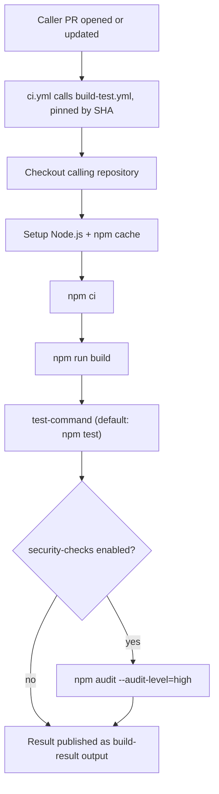

# Reusable Build & Test

A reusable GitHub Actions workflow that gives any repository in this org the same Node.js
build, test, and security-audit pipeline without redefining it in every repo.

## Why this repository exists

CI configuration tends to get copied between repositories, then drifts: different Node
versions, unpinned actions, forgotten audit steps. The goal here is one maintained pipeline.
A caller repository keeps a single job in its own workflow file and delegates everything
else to this repository. Runner images, Node defaults, action updates, and audit policy are
decided once here and rolled out to callers by moving a release tag's commit SHA.

## What the workflow does

Triggered through `workflow_call`. Runs on `ubuntu-24.04` with `contents: read`
permissions and no access to caller secrets:

1. Check out the calling repository
2. Set up Node.js (`node-version` input, npm cache keyed on the caller's lockfile)
3. `npm ci`
4. `npm run build`
5. Run `test-command`
6. If `security-checks` is true, `npm audit --audit-level=high`



## Usage

```yaml
jobs:
  build-and-test:
    name: Build & Test
    uses: enofei/reusable-build-test/.github/workflows/build-test.yml@59e8e1fb94b462eae54949475096c923b930d592  # v1.0.0
    with:
      node-version: '24'
      test-command: 'npm run test:ci'
      security-checks: true
```

Always pin a full commit SHA with a version comment. Branch and tag refs are mutable and
can change after review; a SHA cannot.

## Inputs

| Input | Type | Default | Description |
|---|---|---|---|
| `node-version` | string | `'24'` | Node.js version passed to `actions/setup-node` (current LTS line) |
| `test-command` | string | `'npm test'` | Command run after the build |
| `working-directory` | string | `'.'` | Directory containing the Node project |
| `security-checks` | boolean | `false` | Also run `npm audit --audit-level=high` |

## Output

`build-result` — the result of the `build-and-test` job (`success`, `failure`, and so on).

## What callers must provide

Inside `working-directory`: a `package.json`, a `package-lock.json` (the npm cache step
fails without it), a `build` script, and the script named by `test-command`. That is the
whole contract.

## Resolving a release tag to a pin

```bash
./scripts/resolve-action-sha.sh enofei/reusable-build-test v1.0.0
# prints: <commit-sha>  # v1.0.0
```

The script dereferences annotated tags, so the output is always a commit SHA.

## Branch and signing policy

`main` accepts only commits with verified signatures. Branch protection enforces this with
administrators included, so GitHub itself refuses unsigned or unverified pushes (`GH006`).
Routine work happens on `dev`; a signed commit from `dev` can be pushed to `main` directly,
or merged through a pull request (GitHub signs its merge commits). Commits made on a machine
with the signing configuration in place are signed automatically.

## Releasing

1. Merge changes into `main`.
2. Tag it: `git tag -a vX.Y.Z -m "..." && git push origin vX.Y.Z`.
3. Update caller pins to the tag's commit SHA using the script above.

Dependabot runs weekly (Mondays) and opens grouped PRs that bump the pinned action SHAs
with a `ci` commit prefix.

## Local testing

There is no local runner for a `workflow_call` job. Changes are tested by opening a pull
request in a caller repository (see `enofei/caller-repo`), which exercises the workflow
against real code before a release tag is cut.
